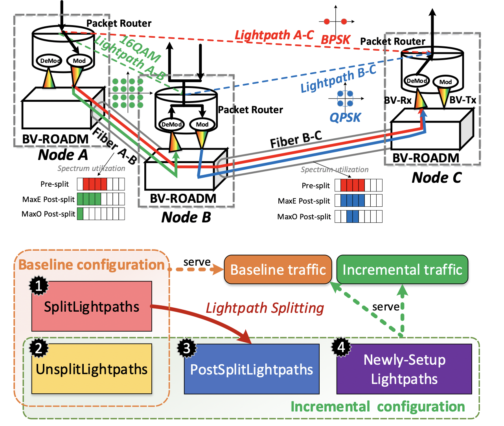

# LPSplitting
Simulation code for the LPSplitting paper in IEEE/ACM Trans. Netw. 27 (4), 1460-1473

## Publication
Zhizhen Zhong, Nan Hua, Massimo Tornatore, Jialong Li, Yanhe Li, Xiaoping Zheng, and Biswanath Mukherjee. "Provisioning short-term traffic fluctuations in elastic optical networks." IEEE/ACM Transactions on Networking 27, no. 4 (2019): 1460-1473. https://dl.acm.org/doi/abs/10.1109/TNET.2019.2925631

<a href="https://cloud.tsinghua.edu.cn/f/cfc0362c3f3d4cc49154/" target="_blank">Read the Paper</a>

## Abstract
Transient traffic spikes are becoming a crucial challenge for network operators from both user-experience and network-maintenance perspectives. Different from long-term traffic growth, the bursty nature of short-term traffic fluctuations makes it difficult to be provisioned effectively. Luckily, next-generation elastic optical networks (EONs) provide an economical way to deal with such short-term traffic fluctuations. In this paper, we go beyond conventional network reconfiguration approaches by proposing the novel lightpath-splitting scheme in EONs. In lightpath splitting, we introduce the concept of SplitPoints to describe how lightpath splitting is performed. Lightpaths traversing multiple nodes in the optical layer can be split into shorter ones by SplitPoints to serve more traffic demands by raising signal modulation levels of lightpaths accordingly. We formulate the problem into a mathematical optimization model and linearize it into an integer linear program (ILP). We solve the optimization model on a small network instance and design scalable heuristic algorithms based on greedy and simulated annealing approaches. Numerical results show the tradeoff between throughput gain and negative impacts like traffic interruptions. Especially, by selecting SplitPoints wisely, operators can achieve almost twice as much throughput as conventional schemes without lightpath splitting.

      
